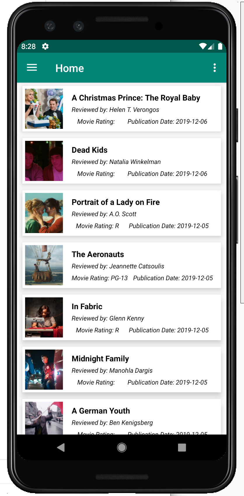

# NYTimesMovieReview
This application is my attempt at [Android Architecture Components][aacusage] usage.

I wanted to test out AAC and Kotlin Coroutines using NYTimes API. You will need to register [here][nytimesapi] and get your own api key for this app to work.

App uses a shared object library, to save the NY Times API key, to make it difficult (but not impossible) to be hacked. It also uses Room database for saving server response (not really needed but added for supporting future enhancements). 

Because I wanted this app to be as production ready as possible I integrated Crashlytics (will need google-services.json from your Firebase account), setup build variants for debug and release builds, and setup signing for the app with a local.properties file holding the passwords (obviously not checked in). The app also supports different icons and app identifiers, for debug and release builds. This allows us to install debug and release builds on same device, useful in testing.

App does dependency injection differently, using ActivityLifecycleCallbacks, similar to what is done in [AAC sample apps][aacsampleapp]. Lastly I used the navigation component library because I wanted the nav graph (very useful for passing arguments to fragments), and a drawer menu so that I can add new features there.

Make sure to edit [native-lib.cpp][sofile] to add your NY Times API key.

This application implements the following concepts :
- Single Activity and multiple fragments setup
- ViewModels and ViewModelScope usage
- Using LiveData and MutableLiveData for handling network/database requests
- Room for network call response storage
- Navigation component for navigation graph and navigation drawer
- Kotlin coroutines usage with suspend keyword
- DI with Dagger 2, using ActivityLifecycleCallbacks 

[aacsampleapp]: https://github.com/android/architecture-components-samples/tree/master/GithubBrowserSample
[sofile]: https://github.com/omermuhammed/NYTMovieReviews/blob/master/app/src/main/cpp/native-lib.cpp
[aacusage]: https://developer.android.com/topic/libraries/architecture/guide.html
[nytimesapi]: https://developer.nytimes.com/apis
